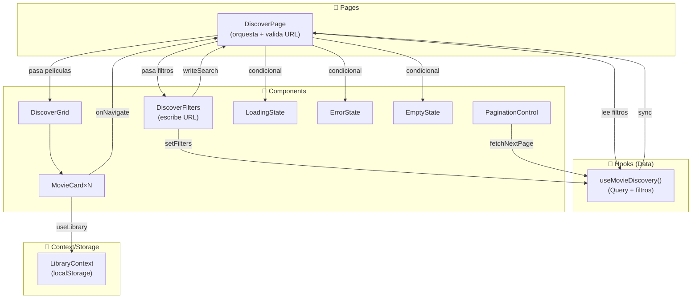
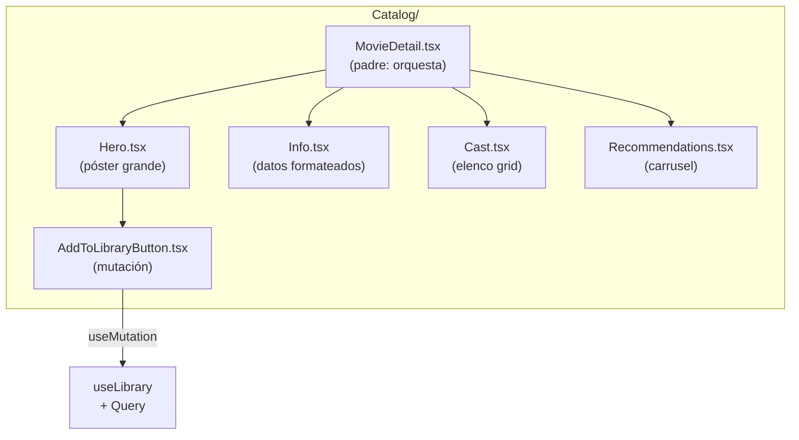

# Arquitectura de Componentes — Cineteca

## Flujo de datos (DiscoverPage como ejemplo)



---

## Jerarquía de componentes (movieDetail como ejemplo de subcarpeta)



---

## Estado de cada componente

| Componente             | Responsabilidad                               | Vive en                | Escucha                                         |
| ---------------------- | --------------------------------------------- | ---------------------- | ----------------------------------------------- |
| **DiscoverPage**       | Orquesta filtros + grid + estados; valida URL | `pages/`               | `useMovieDiscovery`, URL                        |
| **DiscoverFilters**    | Controles de filtro, escribe en URL           | `Catalog/`             | props: `filters`, callback: `onChangeFilters`   |
| **DiscoverGrid**       | Grid infinito de películas                    | `Catalog/`             | props: `movies`                                 |
| **MovieCard**          | Tarjeta individual con póster y metadata      | `Common/`              | props: `movie`, callback: `onNavigate`          |
| **LoadingState**       | Skeleton mientras carga                       | `Common/`              | props: `count`                                  |
| **ErrorState**         | Mensaje de error + reintentar                 | `Common/`              | props: `message`, callback: `onRetry`           |
| **EmptyState**         | Vacío inicial o por filtro                    | `Common/`              | props: `title`, `message`, callback: `onAction` |
| **MovieDetail**        | Orquesta Hero + Info + Cast + Rec             | `Catalog/MovieDetail/` | `useMovieDetail`                                |
| **Hero**               | Póster grande + título + CTA                  | `Catalog/MovieDetail/` | props: `movie`                                  |
| **Info**               | Sinopsis, presupuesto, duración (formateado)  | `Catalog/MovieDetail/` | props: `movie`                                  |
| **Cast**               | Grid de actores                               | `Catalog/MovieDetail/` | props: `cast`                                   |
| **Recommendations**    | Carrusel de recomendadas                      | `Catalog/MovieDetail/` | props: `movies`                                 |
| **AddToLibraryButton** | Agregar/quitar de biblioteca                  | `Catalog/MovieDetail/` | `useLibrary` + `useMutation`                    |
| **SearchInput**        | Input con debounce                            | `Search/`              | props: `value`, callback: `onChange`            |
| **SearchResults**      | Grid de resultados                            | `Search/`              | `useMovieSearch`                                |
| **LibraryGrid**        | Grid de películas guardadas                   | `Library/`             | `useLibrary`                                    |
| **ListManager**        | Crear/editar/borrar listas                    | `Library/`             | `useLibrary` + `useMutation`                    |
| **ListForm**           | Formulario validado de listas                 | `Library/`             | `useForm` + Zod schema                          |

---

## Flujos de sincronización

### Agregar película a biblioteca

```
AddToLibraryButton
  ↓ (click)
useMutation (POST-optimist)
  ↓ (instant)
LibraryContext.add()
  ↓ (escribe localStorage)
[localStorage actualizado]
  ↓ (validado al leer)
LibraryGrid + LibraryPage se redibujan

  ← Si falla: revert automático + ErrorState
```

### Cambiar filtro en Discover

```
DiscoverFilters (onChange)
  ↓
setFilters()
  ↓
URL query params actualizados (pushState)
  ↓
useMovieDiscovery() se retrigger (por queryKey)
  ↓
Query fetches nuevos resultados
  ↓
DiscoverGrid se redibuja
```

### Validación en bordes

```
DiscoverPage (al montar)
  ↓
Lee URL: ?genre=99&year=abc
  ↓
Valida con Zod (genre: enum, year: number)
  ↓
Si inválido: fallback a valores por defecto
  ↓
useMovieDiscovery() recibe valores seguros
```

---

## Props vs Context vs Hooks

| Patrón      | Cuándo                                    | Ejemplo                                   |
| ----------- | ----------------------------------------- | ----------------------------------------- |
| **Props**   | Datos que cambian por pantalla            | `MovieCard` recibe `movie: Movie`         |
| **Hooks**   | Data fetching + state global transitorio  | `useMovieDiscovery()`, `useMovieSearch()` |
| **Context** | Estado persistente compartido             | `LibraryContext` (biblioteca del usuario) |
| **URL**     | Estado que se puede compartir/bookmarkear | Filtros de discover, ID de película       |

---

## Composición: ¿componente o hook?

**Es un componente si:**

- Retorna JSX
- Maneja su propio render condicional
- Necesita estar en el árbol de componentes

**Es un hook si:**

- Retorna datos + funciones
- No renderiza nada (o retorna datos que otro componente renderiza)
- Encapsula lógica reutilizable

**Ejemplo:**

```typescript
// ❌ Malo: lógica de datos retornando JSX
function useDiscoverWithUI() {
  const { movies, isLoading } = useMovieDiscovery();
  return <DiscoverGrid movies={movies} />; // ← Esto es un componente, no un hook
}

// ✅ Bien: hook retorna datos
function useMovieDiscovery() {
  return { movies, filters, setFilters, isLoading, error };
}

// ✅ Bien: componente usa el hook
function DiscoverPage() {
  const { movies, isLoading } = useMovieDiscovery();
  return <DiscoverGrid movies={movies} />;
}
```

---

## Reglas de la arquitectura

1. **Domain no importa React.** Entidades, policies, schemas viven en TypeScript puro.
2. **Presentation no importa Axios.** Todo pasa por `infrastructure/` → `application/` → `domain/`.
3. **Componentes reciben datos por props.** No hagan queries dentro de `<MovieCard>`.
4. **Hooks traen datos, componentes los pintan.** No mezcles.
5. **Context solo para estado persistente compartido.** Filtros momentáneos van en URL o React Query.
6. **URL es el fuente de verdad para el estado navegable.** Si se puede bookmarkear, va en la URL.

---

## Próximos pasos

- [ ] Crear estructura de carpetas
- [ ] Escribir tipos en `domain/entities/`
- [ ] Crear schemas Zod en `domain/`
- [ ] Implementar `infrastructure/api/` (TMDB client)
- [ ] Crear hooks en `presentation/hooks/`
- [ ] Componentes `Common/` (base reutilizable)
- [ ] Componentes `Catalog/` (discover + detalle)
- [ ] Tests unitarios para domain (100%)
- [ ] Tests de componentes con RT + MSW (80%)
